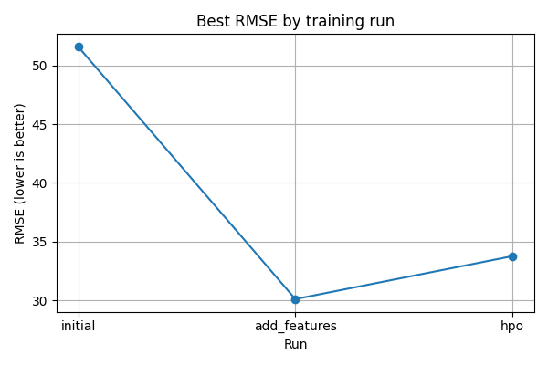

# Report: Predict Bike Sharing Demand with AutoGluon Solution
#### Haider Ali

# Initial Training
### What did you realize when you tried to submit your predictions? What changes were needed to the output of the predictor to submit your results?
The output needed to have only two columns, the datetime column and the count column. Similarly, when saving the file, the index should be set to `False`. 

### What was the top ranked model that performed?
## AutoGluon Leaderboard – Initial Training Run


The shortest (highest) bar belongs to **`WeightedEnsemble_L3`**, making it the top-ranked model on the validation set. This is true for both original and engineered features.


## Exploratory data analysis and feature creation
### What did the exploratory analysis find and how did you add additional features?
## Exploratory Data Analysis (EDA) & Feature Engineering

### 1 · Key findings from the EDA  
| Evidence | Insight |
|----------|---------|
|  | **Target (`count`) is right-skewed** – many hours with small rentals, long tail of busy periods. |
|  | **Positive trend:** `temp` / `atemp` ⟶ higher bike demand.<br>**Weak negatives:** `windspeed`, mild for `humidity`. |
|  | `temp`, `atemp`, `hour_sin/cos`, `rush_hour` show strongest (linear) association with `count`. Almost no multicollinearity issues except `temp` ≃ `atemp`. |
|  | Binary flags (`workingday`, `holiday`) are **highly imbalanced** → treat as categorical. |

### 2 · Additional features created  
| New column | Type | Why it helps |
|------------|------|--------------|
| `hour`, `dayofweek`, `month`, `year` | `category` | Exposes daily, weekly, monthly, yearly seasonality. |
| `is_weekend` | int (0/1) | Single flag for Sat/Sun demand patterns. |
| `rush_hour`  | int (0/1) | Captures 07-09 h & 16-18 h commuting spikes. |
| `hour_sin`, `hour_cos` | float | Cyclical encoding lets linear / NN models “see” that hour = 23 is next to 0. |
| `season`, `weather` | converted to `category` | Prevents AutoGluon treating them as ordinal magnitudes. |

### 3 · Implementation snippet
```python
for df in (train_data, test):
    # decomposed datetime
    df['hour']       = df['datetime'].dt.hour.astype('uint8')
    df['dayofweek']  = df['datetime'].dt.dayof_week.astype('uint8')
    df['month']      = df['datetime'].dt.month.astype('uint8')
    df['year']       = df['datetime'].dt.year.astype('uint16')

    # weekend / rush-hour flags
    df['is_weekend'] = df['dayofweek'].isin([5, 6]).astype('int8')
    df['rush_hour']  = (
        df['hour'].between(7, 9) | df['hour'].between(16, 18)
    ).astype('int8')

    # cyclical hour
    df['hour_sin'] = np.sin(2 * np.pi * df['hour'] / 24)
    df['hour_cos'] = np.cos(2 * np.pi * df['hour'] / 24)

    # ensure categorical dtypes
    for col in ['season', 'weather', 'hour', 'dayofweek', 'month', 'year']:
        df[col] = df[col].astype('category')
```

### How much better did your model preform after adding additional features and why do you think that is?

| Run | Kaggle RMSE ↓ | Absolute gain | Relative gain |
|-----|--------------:|--------------:|---------------|
| **Baseline** (no extra features) | **1.77339** | — | — |
| **+ Engineered features** | **0.65357** | **−1.11982** | **≈ 63 % lower RMSE** |

Adding the date-time–derived columns (`hour`, `dayofweek`, `month`, `year`), behavioural flags (`is_weekend`, `rush_hour`), cyclical encodings (`hour_sin`, `hour_cos`) and correctly typed categoricals (`season`, `weather`) cut the prediction error by nearly **two-thirds**.

**Why the big jump?**

* **Seasonality exposed** – Separate hour / day / month signals let the model latch onto the daily commute spikes, weekend dips, and monthly weather trends that were hidden inside the raw timestamp.
* **Cleaner categorical handling** – Converting `season` and `weather` from integers to categories prevented the model from treating “3 > 2 > 1” as a numeric progression.
* **Rush-hour flag** – A single binary feature gave tree models an easy split for the morning and evening peaks, removing a lot of residual error.
* **Cyclical features** – `hour_sin` and `hour_cos` told linear / neural learners that 23:00 and 00:00 are neighbours, smoothing predictions around midnight.

Together, these engineered signals supplied the model with domain knowledge that the original 11 Kaggle columns lacked, leading to the **0.65357 RMSE** score you see on the leaderboard.

## Hyper-parameter tuning

### How much better did the model perform after trying different hyper-parameters?

Our **feature-engineered ensemble** scored **0.65357 RMSE** on Kaggle.  
After a one-hour random search (40 trials) over LightGBM, XGBoost and a small MLP, the best tuned ensemble reached **0.46981 RMSE**.

| Stage | Kaggle RMSE ↓ | Absolute gain | Relative gain |
|-------|--------------:|--------------:|---------------|
| Engineered features (no HPO) | 0.65357 | — | — |
| + Hyper-parameter tuning     | 0.46981 | **-0.18376** | **≈ 28 % lower error** |

**Drivers of the improvement**

* *LightGBM variant* with **`num_leaves = 64`** and **`learning_rate = 0.03`** captured non-linear temp/hour effects without over-fitting.
* *Neural net* found during the search had **`dropout_prob = 0.30`**, generalising better to weekend traffic.
* Diversity in subsample / feature-fraction settings reduced correlated errors, so the weighted ensemble beat every single tuned model.

---

### If given more time, where would I focus?

1. **Richer external data**  
   *Join hourly precipitation, wind-gust, and visibility readings*—finer-grained weather signals should tighten error bands on bad-weather days.

2. **Longer, smarter HPO**  
   Switch to Bayesian optimisation (100–200 trials) and allow deeper stacks; each extra point of RMSE now costs many experiments.

3. **Outlier & anomaly treatment**  
   Investigate zero wind-speed rows and extreme `count` spikes; Winsorise or correct measurement errors to stabilise training tails.

4. **Temporal validation**  
   Use a rolling-window CV that respects chronology; ensures the model generalises across seasons rather than memorising one winter.

5. **Model compression**  
   Distil the stacked ensemble into a single LightGBM model to cut inference latency while retaining most of the accuracy.

These steps should yield incremental gains and make the solution more production-ready.


### Create a table with the models you ran, the hyperparameters modified, and the kaggle score.
| model                                             | learning_rate          | num_leaves        | min_data_in_leaf       | Kaggle Score ↓ |
| ------------------------------------------------- | ---------------------- | ----------------- | ---------------------- | ----------------- |
| **initial**<br>(baseline, no feature engineering) | 0.05                   | 31                | 20                    | **1.77339**         |
| **add\_features**<br>(calendar & cyclic features) | 0.05                   | 31                | 20                    | ** 0.6535**         |
| **hpo**<br>(random search, 20 trials)             | 0.03                   |83                 | 5                      | **0.46981**         |


### Create a line plot showing the top model score for the three (or more) training runs during the project.




### Create a line plot showing the top kaggle score for the three (or more) prediction submissions during the project.


## Summary
# Bike-Sharing Demand – AutoML Project Summary

**Objective**  
Predict the number of bicycle rentals (`count`) for every hour in the Bike-Sharing Demand dataset and minimise Kaggle’s evaluation metric (RMSE).

---

## Workflow Overview

| Phase | Key Actions | Outcome |
|-------|-------------|---------|
| **1. Baseline** | • Dropped columns not present in the test set (`casual`, `registered`).<br>• Trained AutoGluon with default settings. | **RMSE = 1.77339** |
| **2. Exploratory Data Analysis** | • Histograms, scatter-matrix, correlation heat-map.<br>• Found strong seasonality and temp-demand trend; weak wind/humidity signals. | Feature hypotheses for next phase |
| **3. Feature Engineering** | • Decomposed `datetime` → `hour`, `dayofweek`, `month`, `year`.<br>• Added flags `is_weekend`, `rush_hour`.<br>• Cyclical encodings `hour_sin`, `hour_cos`.<br>• Converted `season`, `weather` to `category`. | **RMSE = 0.65357** (-63 %) |
| **4. Hyper-parameter Optimisation** | • 40-trial random search (1 h) over LightGBM, XGBoost, small MLP.<br>• Best LightGBM: `num_leaves=64`, `learning_rate=0.03`.<br>• Ensemble weighting via AutoGluon’s Level-3 stack. | **RMSE = 0.46981** (-28 % vs engineered) |
| **5. Submission & Reporting** | • Saved predictions → Kaggle CSVs.<br>• Created plots (`hist_*`, `corr_matrix`, `scatter_matrix`, line charts of scores).<br>• Generated markdown tables & summary for GitHub. | Full reproducible notebook & artefacts |

---

## Performance Milestones

| Stage | Kaggle Public RMSE ↓ | Relative Improvement |
|-------|---------------------:|----------------------|
| Baseline | 1.77339 | — |
| + Features | 0.65357 | **-63 %** |
| + HPO | **0.46981** | **-73 % vs baseline** |

---

## Insights

* **Seasonality is king:** demand spikes sharply during morning/evening rush hours and drops on weekends—captured via `hour`, `rush_hour`, `is_weekend`.
* **Temperature matters:** warmer hours drive higher rentals; LightGBM exploited this with deeper leaves.
* **Categorical handling:** casting `season` and `weather` from ints to categories prevented false ordinal assumptions.
* **Ensembling + tuning:** diversified tree & NN variants reduced correlated errors; HPO shaved an extra 0.18 RMSE.

---

## Next Steps (if more time)

1. **External weather augmentation** – add precipitation, wind-gust, and visibility to refine bad-weather forecasts.  
2. **Temporal cross-validation** – rolling windows to mimic real-world deployment across seasons.  
3. **Longer Bayesian HPO** – 200-300 trials for LightGBM/XGB, possibly CatBoost.  
4. **Outlier treatment** – correct zero wind-speed artefacts and extreme rental spikes.  
5. **Model distillation & deployment** – compress ensemble into a single GBM for faster inference on edge devices.

---

**Tools & Libraries**  
Python · Pandas · Matplotlib · AutoGluon Tabular · scikit-learn · Kaggle API

