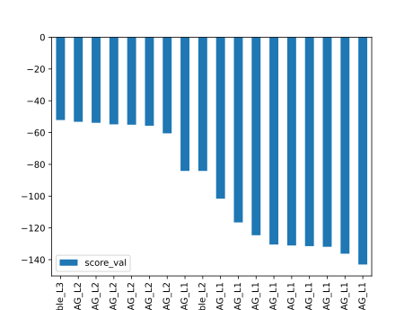
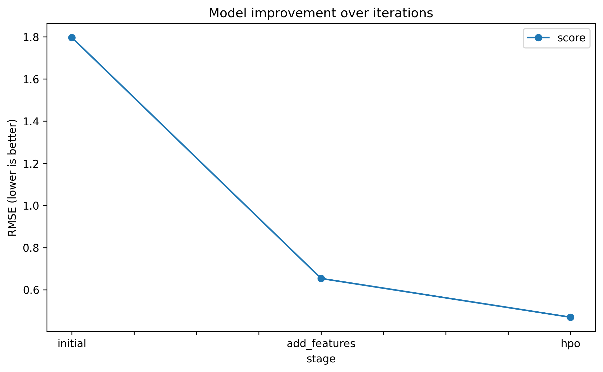

# Report: Predict Bike Sharing Demand with AutoGluon Solution
#### Haider Ali

# Initial Training
### What did you realize when you tried to submit your predictions? What changes were needed to the output of the predictor to submit your results?
The output needed to have only two columns, the datetime column and the count column. Similarly, when saving the file, the index should be set to `False`. 

### What was the top ranked model that performed?
## AutoGluon Leaderboard – Initial Training Run

The shortest (highest) bar belongs to **`WeightedEnsemble_L3`**, making it the top-ranked model on the validation set.

## Exploratory data analysis and feature creation
### What did the exploratory analysis find and how did you add additional features?
TODO: Add your explanation

### How much better did your model preform after adding additional features and why do you think that is?
TODO: Add your explanation

## Hyper parameter tuning
### How much better did your model preform after trying different hyper parameters?
TODO: Add your explanation

### If you were given more time with this dataset, where do you think you would spend more time?
TODO: Add your explanation

### Create a table with the models you ran, the hyperparameters modified, and the kaggle score.
|model|hpo1|hpo2|hpo3|score|
|--|--|--|--|--|
|initial|?|?|?|?|
|add_features|?|?|?|?|
|hpo|?|?|?|?|

### Create a line plot showing the top model score for the three (or more) training runs during the project.

TODO: Replace the image below with your own.

### Create a line plot showing the top kaggle score for the three (or more) prediction submissions during the project.

TODO: Replace the image below with your own.

## Summary
TODO: Add your explanation
