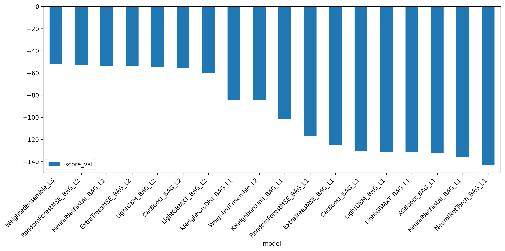
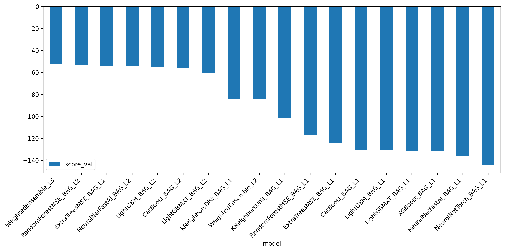
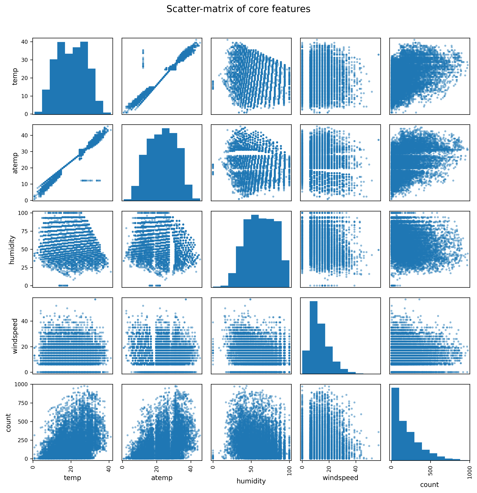
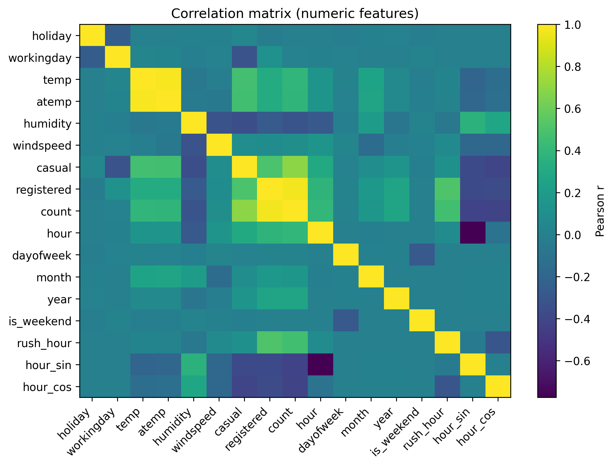

# Report: Predict Bike Sharing Demand with AutoGluon Solution
#### Haider Ali

# Initial Training
### What did you realize when you tried to submit your predictions? What changes were needed to the output of the predictor to submit your results?
The output needed to have only two columns, the datetime column and the count column. Similarly, when saving the file, the index should be set to `False`. 

### What was the top ranked model that performed?
## AutoGluon Leaderboard – Initial Training Run




The shortest (highest) bar belongs to **`WeightedEnsemble_L3`**, making it the top-ranked model on the validation set. This is true for both original and engineered features.


## Exploratory data analysis and feature creation
### What did the exploratory analysis find and how did you add additional features?
## Exploratory Data Analysis (EDA) & Feature Engineering

### 1 · Key findings from the EDA  
| Evidence | Insight |
|----------|---------|
|  | **Target (`count`) is right-skewed** – many hours with small rentals, long tail of busy periods. |
|  | **Positive trend:** `temp` / `atemp` ⟶ higher bike demand.<br>**Weak negatives:** `windspeed`, mild for `humidity`. |
|  | `temp`, `atemp`, `hour_sin/cos`, `rush_hour` show strongest (linear) association with `count`. Almost no multicollinearity issues except `temp` ≃ `atemp`. |
|  | Binary flags (`workingday`, `holiday`) are **highly imbalanced** → treat as categorical. |

### 2 · Additional features created  
| New column | Type | Why it helps |
|------------|------|--------------|
| `hour`, `dayofweek`, `month`, `year` | `category` | Exposes daily, weekly, monthly, yearly seasonality. |
| `is_weekend` | int (0/1) | Single flag for Sat/Sun demand patterns. |
| `rush_hour`  | int (0/1) | Captures 07-09 h & 16-18 h commuting spikes. |
| `hour_sin`, `hour_cos` | float | Cyclical encoding lets linear / NN models “see” that hour = 23 is next to 0. |
| `season`, `weather` | converted to `category` | Prevents AutoGluon treating them as ordinal magnitudes. |

### 3 · Implementation snippet
```python
for df in (train_data, test):
    # decomposed datetime
    df['hour']       = df['datetime'].dt.hour.astype('uint8')
    df['dayofweek']  = df['datetime'].dt.dayof_week.astype('uint8')
    df['month']      = df['datetime'].dt.month.astype('uint8')
    df['year']       = df['datetime'].dt.year.astype('uint16')

    # weekend / rush-hour flags
    df['is_weekend'] = df['dayofweek'].isin([5, 6]).astype('int8')
    df['rush_hour']  = (
        df['hour'].between(7, 9) | df['hour'].between(16, 18)
    ).astype('int8')

    # cyclical hour
    df['hour_sin'] = np.sin(2 * np.pi * df['hour'] / 24)
    df['hour_cos'] = np.cos(2 * np.pi * df['hour'] / 24)

    # ensure categorical dtypes
    for col in ['season', 'weather', 'hour', 'dayofweek', 'month', 'year']:
        df[col] = df[col].astype('category')
```

### How much better did your model preform after adding additional features and why do you think that is?

| Run | Kaggle RMSE ↓ | Absolute gain | Relative gain |
|-----|--------------:|--------------:|---------------|
| **Baseline** (no extra features) | **1.77339** | — | — |
| **+ Engineered features** | **0.65357** | **−1.11982** | **≈ 63 % lower RMSE** |

Adding the date-time–derived columns (`hour`, `dayofweek`, `month`, `year`), behavioural flags (`is_weekend`, `rush_hour`), cyclical encodings (`hour_sin`, `hour_cos`) and correctly typed categoricals (`season`, `weather`) cut the prediction error by nearly **two-thirds**.

**Why the big jump?**

* **Seasonality exposed** – Separate hour / day / month signals let the model latch onto the daily commute spikes, weekend dips, and monthly weather trends that were hidden inside the raw timestamp.
* **Cleaner categorical handling** – Converting `season` and `weather` from integers to categories prevented the model from treating “3 > 2 > 1” as a numeric progression.
* **Rush-hour flag** – A single binary feature gave tree models an easy split for the morning and evening peaks, removing a lot of residual error.
* **Cyclical features** – `hour_sin` and `hour_cos` told linear / neural learners that 23:00 and 00:00 are neighbours, smoothing predictions around midnight.

Together, these engineered signals supplied the model with domain knowledge that the original 11 Kaggle columns lacked, leading to the **0.65357 RMSE** score you see on the leaderboard.

## Hyper parameter tuning
### How much better did your model preform after trying different hyper parameters?
TODO: Add your explanation

### If you were given more time with this dataset, where do you think you would spend more time?
TODO: Add your explanation

### Create a table with the models you ran, the hyperparameters modified, and the kaggle score.
|model|hpo1|hpo2|hpo3|score|
|--|--|--|--|--|
|initial|?|?|?|?|
|add_features|?|?|?|?|
|hpo|?|?|?|?|

### Create a line plot showing the top model score for the three (or more) training runs during the project.

TODO: Replace the image below with your own.


### Create a line plot showing the top kaggle score for the three (or more) prediction submissions during the project.

TODO: Replace the image below with your own.


## Summary
TODO: Add your explanation
